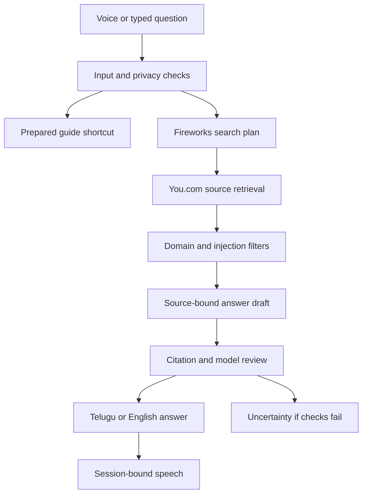

# Swayam · స్వయం

Your voice. Your language. Your independence.

A Telugu-first assistant inspired by parents who ask their children for help with everyday tasks. Speak naturally, receive a simple explanation with sources, and ask a follow-up. Thirteen authored shortcuts remain available for common tasks. The open-question pipeline needs Fireworks + You.com; optional cloud voice uses ElevenLabs.

**Start with [START_HERE.md](START_HERE.md).** Follow the laptop clone, API-key setup, phone checks and Week 6 red-team walkthrough. [docs/SETUP_AND_SUBMISSION.md](docs/SETUP_AND_SUBMISSION.md) contains the detailed code map and privacy boundaries.

Hosted: https://swayam.drkreddy.chatgpt.site (owner-private).

```sh
pnpm install
# Create ignored .dev.vars using .env.example; add keys locally.
pnpm dev
```

## Architecture



No personal-record tools, transactions, shared chat database or persistent memory are connected. The app does not store audio; speech providers may retain it under their account policies. Pattern-based PII detection and model review are imperfect. Private access and best-effort rate limiting are not production compliance certification.

## Evaluation

```sh
node scripts/evaluate.mjs
node scripts/evaluate-answers.mjs
```

Evidence lives in public/evidence. Guided controls and mocked provider tests are labelled separately. /evaluation also runs 16 web-answer tests after configuration; generated factual answers need human source review before PASS. /setup explains configuration. Live provider calls, real phone speech and human Telugu review remain pending until performed.
