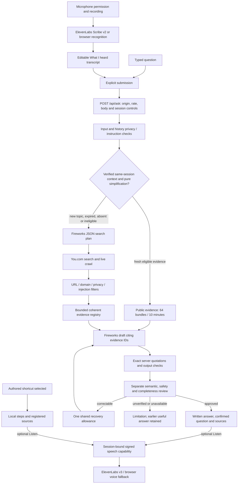

# Swayam architecture and boundaries

Swayam is a Telugu-first, read-only everyday knowledge assistant. It provides written explanations with sources, optional speech and thirteen authored shortcuts. It cannot look up private account records or carry out transactions, purchases, verification or KYC.

Recovery is bounded across draft structure, citations, semantic corrections and truncated reviews. The request-wide deadline defaults to 60 seconds and propagates cancellation through fetch and response-body reads. Written text returns before optional speech. The welcome uses registered text, not arbitrary user-supplied speech.

Generation now constrains at most twelve paragraph strings to 230 characters each. The existing server-side 900-character paragraph and 2800-character combined limits remain authoritative, including UTF-16 length checks. The 3200-token draft budget is unchanged. No generated answer is silently sliced; incomplete or unsupported text still requires correction or is rejected. This addresses the length failure discovered in the first hosted release; short paragraph boundaries can still be awkward, as recorded in the findings.

## Implementation map

| Responsibility | Code / service |
| --- | --- |
| Transcript, confirmation, retained answers, cancellation, layouts | `app/page.tsx`, `app/globals.css` |
| Flag and artwork | `components/india-flag.tsx`, `public/images/` |
| Input/privacy checks and guides | `lib/agent.ts`, `lib/guides.ts` |
| Retrieval, exact citations and separate review | `lib/answers.ts`, `lib/evidence.ts` |
| Model-specific reasoning / JSON options | `lib/fireworks-options.ts` |
| Deadline and one retry | `lib/answer-runtime.ts` |
| Public-evidence reuse | `lib/followup-evidence.ts` |
| Origin/body/rate/session controls | `lib/server-safety.ts`, `app/api/ask/route.ts` |
| Optional audio | `app/api/transcribe/route.ts`, `app/api/speak/route.ts`; ElevenLabs |
| Build / hosting | Vinext, Vite, Cloudflare-compatible Worker, Sites |

## Evidence boundaries

Search receives a planned public query, not provider keys. Government/legal/financial questions enforce approved official-domain families; health uses approved public-health/official sources. Ordinary crafts and cooking can use instructional publishers. HTTPS, hostname, credential-bearing URL and private-content checks run before evidence is accepted.

The extractor bounds pages and ranks coherent method sections. The model returns paragraph text and server-created evidence IDs. The server reconstructs exact quotations, checks output safety, language, length and references, then separately reviews claim support and completeness. A matching quotation alone does not prove a claim. Review remains probabilistic: the rejected alternate-model trial approved defective answers. Source support is not a universal accuracy or expertise guarantee.

Only documented public model families receive explicit compatible reasoning settings. Unknown/private paths do not inherit speculative options. Telugu draft and structured-review budgets remain intact. References: [Fireworks chat-completions options](https://docs.fireworks.ai/api-reference/post-chatcompletions) and [structured outputs](https://docs.fireworks.ai/structured-responses/structured-response-formatting).

## Privacy and session limits

- API settings remain server-side. Production responses omit development timings. Local sign-in is Vite development middleware, not the deployed Worker.
- Up to four preceding questions and the current answer capability remain in page memory. Reset/reload drops page context. Signed payloads authenticate text; they do not encrypt it from their holder.
- An HttpOnly, SameSite=Strict cookie binds capabilities to a browser session; HTTPS adds Secure. Signatures expire after fifteen minutes. A token alone fails in B; transferring both token and cookie is accepted bearer-credential replay. This is not device-bound user authentication.
- The cache stores bounded public passages, public query/category and original retrieval time—not questions, answers, recordings or private records. Its keys hash verified capabilities. Only general/food/culture evidence is eligible, for at most ten minutes without refreshing its age. Other topics, expired entries and other Worker isolates retrieve again. Every generated answer is validated and reviewed.
- D1 and R2 are unset. No shared conversation or protected-record datastore exists. An extraction test against a nonexistent private store cannot be marked PASS.
- Audio reaches the provider before its transcript can be screened. The app does not persist it but cannot promise provider non-retention. Browser recognition may use browser-managed services. Do not speak credentials or identity numbers.
- Pattern checks cannot recognize every personal detail or obfuscation. Finite tests do not establish production security certification.
- Rate limiting is best-effort per Worker isolate, keyed by a hashed client IP (local fallback when unavailable), not a distributed abuse-control system.

## Deployment

The existing project is `appgprj_6aada40fc39081919267705bf3a7ed6e`. Preserve its identity, audience and backend. Local configuration and hosted secret variables are separate. Push source before saving/deploying a version. The release report distinguishes the tested application commit, later evidence-only commits, Sites deployment and hosted browser verification.
